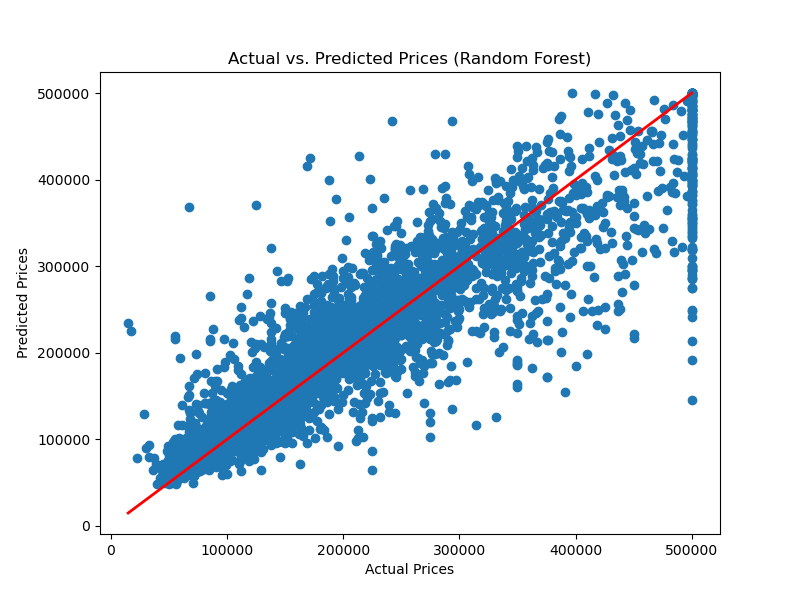

# 🏠 Housing Price Prediction for California

  

This project builds and evaluates machine learning models to predict housing prices in California. The goal was to start with a simple model and then demonstrate how a more complex model can significantly improve prediction accuracy.

---

## 📋 Project Overview

The core task is to predict the median house value in California districts based on various features from the 1990 census data. This is a regression problem, where the model learns the relationship between the input features and a continuous numerical output (the price).

### Dataset

The project uses the **California Housing Prices** dataset, sourced from Kaggle.
* **Link to Dataset:** [https://www.kaggle.com/datasets/camnugent/california-housing-prices](https://www.kaggle.com/datasets/camnugent/california-housing-prices)
* **Features:** The dataset includes features like median income, house age, average number of rooms, and geographical location.
* **Target:** The target variable is `median_house_value`.

---

## 🛠️ Methodology

The project followed these key steps:
1.  **Data Loading & Cleaning:** The dataset was loaded using Pandas. The only column with missing data, `total_bedrooms`, was cleaned by filling the missing spots with the column's median value.
2.  **Model Training:** The data was split into an 80% training set and a 20% testing set.
3.  **Model Evaluation:** Two different regression models were trained and evaluated to compare their performance.

---

## 📊 Results & Model Comparison

The key finding of this project is the significant performance gain from using a more advanced model.

| Model | R-squared (R²) Score | Notes |
| :--- | :--- | :--- |
| **Linear Regression** | ~0.59 | A good baseline, but struggles with complex patterns. |
| **Random Forest Regressor**| **0.81** | **A 22% improvement!** Much better at capturing non-linear relationships. |

The Random Forest model provides a much more accurate prediction, explaining **81%** of the price variance in the test data.

### Actual vs. Predicted Prices (Random Forest)

To visualize the model's performance, here is a scatter plot comparing the actual prices to the prices predicted by the Random Forest model. A perfect model would have all points lying on the red diagonal line.

*(Here you will insert your plot image)*

---

## 🚀 How to Run this Project

1.  Clone this repository to your local machine.
2.  Make sure you have Python and the necessary libraries (`pandas`, `scikit-learn`, `xgboost`, `matplotlib`) installed.
3.  Open and run the `Housing_Prediction.ipynb` Jupyter Notebook.

---

* **MD GOLAM RABBANI**
* **Roll: 2203059**
